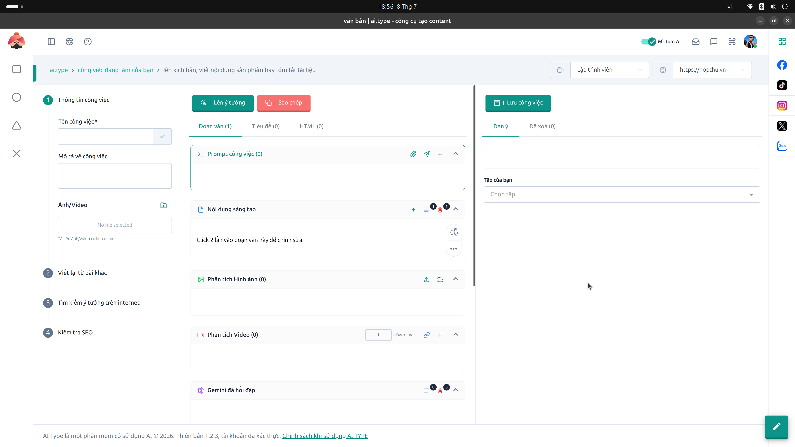

# 1. Hướng dẫn Màn hình "AI Writer" (Công cụ tạo content)

## Giới thiệu Tổng quan
**AI Writer** là "trái tim" của hệ sinh thái ai.type. Đây là không gian làm việc (Workspace) chuyên nghiệp, nơi bạn có thể sáng tạo nội dung, lên kịch bản, viết bài SEO, phân tích tài liệu và kết nối với sức mạnh của trí tuệ nhân tạo (Generative AI). Giao diện được thiết kế tối ưu hóa trải nghiệm người dùng, chia làm 3 cột chính để luồng công việc đi từ trái qua phải một cách mượt mà nhất.

---

## Cột 1: Luồng công việc & Thông tin đầu vào (Bên Trái)
Đây là khu vực bạn cung cấp "nguyên liệu", bối cảnh và định hướng ban đầu cho AI. Việc AI viết hay hoặc dở phụ thuộc rất nhiều vào những gì bạn thiết lập ở cột này.

### Menu 4 bước thực hiện:
Hệ thống cung cấp 4 chế độ làm việc khác nhau:
1. **1. Thông tin công việc:** Đây là chế độ mặc định, dùng để tạo nội dung mới hoàn toàn từ các yêu cầu (prompt) cơ bản.
2. **2. Viết lại từ bài khác:** Tính năng trộn bài (Spin content) hoặc viết lại. Bạn có thể dán một bài báo, một đoạn văn của đối thủ vào đây để AI viết lại bằng văn phong mới mà không lo đạo văn.
3. **3. Tìm kiếm ý tưởng trên internet:** Tính năng này cho phép AI truy cập internet theo thời gian thực để tìm kiếm các thông tin nóng hổi, trending hoặc nghiên cứu số liệu trước khi bắt tay vào viết.
4. **4. Kiểm tra SEO:** Sau khi bài viết hoàn thành, bạn chuyển sang bước này để hệ thống chấm điểm chuẩn SEO (từ khóa, mật độ, thẻ heading, v.v.).

### Thiết lập Thông tin đầu vào:
* **Tên công việc (*):** Bắt buộc nhập. Bạn nên đặt tên ngắn gọn, gợi nhớ (Ví dụ: `Bài đăng Facebook 20/10` hoặc `Review iPhone 15 Pro`). Tên này sẽ dùng để quản lý trong kho lưu trữ sau này.
* **Mô tả về công việc:** Đây là phần quan trọng nhất. Hãy viết một đoạn tóm tắt yêu cầu của bạn. 
  * *Mẹo:* Hãy mô tả càng chi tiết càng tốt: chủ đề bài viết là gì, đối tượng người đọc là ai, văn phong mong muốn (hài hước, chuyên nghiệp, truyền cảm hứng) và độ dài bài viết.
* **Ảnh/Video (Tính năng Vision):** Bạn có thể tải hình ảnh hoặc video ngắn lên. AI của hệ thống có khả năng "nhìn" và phân tích nội dung bên trong file media đó. 
  * *Ứng dụng:* Rất tuyệt vời khi bạn có một bức ảnh sản phẩm và muốn AI tự động viết bài quảng cáo dựa trên những gì nó thấy trong ảnh.

---

## Cột 2: Không gian sáng tạo chính (Ở Giữa)
Sau khi thiết lập xong cột 1, đây là nơi AI sẽ trả kết quả và bạn trực tiếp nhào nặn bài viết.

### Thanh điều khiển thao tác nhanh:
* **Lên ý tưởng (Nút xanh):** Nút kích hoạt AI. Sau khi điền xong cột 1, bấm nút này để AI bắt đầu quá trình suy luận và sinh nội dung.
* **Sao chép (Nút cam):** Copy toàn bộ nội dung bài viết hiện tại vào bộ nhớ tạm (clipboard) chỉ với 1 click.
* **Các Tab hiển thị (Đoạn văn / Tiêu đề / HTML):** 
  * **Đoạn văn:** Hiển thị bài viết dưới dạng văn bản thông thường.
  * **Tiêu đề:** Chỉ lọc và hiển thị cấu trúc thẻ H1, H2, H3 để bạn dễ xem sườn bài.
  * **HTML:** Chuyển đổi bài viết thành mã HTML thô, tiện lợi để copy dán trực tiếp vào website WordPress hoặc nền tảng blog.

### Các khối chức năng thông minh:
* **Prompt công việc:** Nơi bạn có thể tự tay tinh chỉnh hoặc lưu lại các câu lệnh (prompt) phức tạp mà bạn thường dùng.
* **Nội dung sáng tạo:** Đây là khung soạn thảo chính. 
  * **Chỉnh sửa thủ công:** Bạn có thể **click đúp (2 lần)** vào bất kỳ đoạn văn nào để mở khung chỉnh sửa bằng tay.
  * **Viết lại từng phần:** Kế bên mỗi đoạn văn đều có nút 🔄. Nếu bạn không ưng ý đoạn đó, hãy bấm nút này để yêu cầu AI **viết lại riêng đoạn văn đó** mà không làm ảnh hưởng tới các phần khác.
* **Phân tích Hình ảnh / Video:** Nếu bạn đã tải media ở cột 1, kết quả AI "đọc hiểu" file media đó sẽ nằm ở đây.
* **Gemini đã hồi đáp:** Khu vực hiển thị thông báo trực tiếp từ core AI hoặc xem lại lịch sử các lần sinh nội dung.

---

## Cột 3: Dàn ý & Lưu trữ (Bên Phải)
Khu vực này đóng vai trò như một chiếc "tủ hồ sơ" bên cạnh bàn làm việc của bạn.

* **Lưu công việc:** Bạn nên thường xuyên bấm nút này để lưu lại bản nháp (draft) đang làm dở, phòng trường hợp mất điện hoặc rớt mạng.
* **Tab Dàn ý (Outline):** Khu vực nháp tuyệt vời để bạn tự gạch đầu dòng các ý chính (sườn bài). Việc nhìn thấy sườn bài ở cột phải giúp bạn luôn bám sát chủ đề khi chỉnh sửa ở cột giữa.
* **Tab Đã xóa (Thùng rác):** Một tính năng "cứu mạng" khi bạn lỡ tay xóa nhầm một đoạn văn hay. Mọi thứ bạn xóa ở cột giữa đều được lưu trữ tạm thời tại đây để khôi phục (restore) lại.
* **Tập của bạn (Quản lý thư mục):** Menu thả xuống giúp bạn sắp xếp, cất bài viết vào các thư mục riêng biệt (Ví dụ: thư mục *Bài Facebook*, thư mục *Blog Website*, thư mục *Kịch bản Tiktok*).

---

## Thanh công cụ phía trên (Header & Topbar)
Khu vực cung cấp các công cụ cấu hình nâng cao trước khi viết bài.

* **Chọn Vai trò (Persona):** Bạn có thể "ép" AI đóng vai một chuyên gia cụ thể. Ví dụ: Đóng vai *Bác sĩ*, *Chuyên gia Marketing*, *Lập trình viên*. Việc này giúp văn phong và từ ngữ chuyên ngành được sử dụng chuẩn xác, tự nhiên hơn rất nhiều so với AI thông thường.
* **Nguồn tham chiếu:** Nhập link (URL) của một bài báo, một trang web tham khảo. AI sẽ tự động đọc nội dung trang web đó, lấy thông tin làm bối cảnh để viết bài cho bạn.
* **Thanh biểu tượng Mạng Xã Hội:** Một cột dọc với các biểu tượng mờ (Facebook, TikTok, Zalo, Instagram, X...). Tính năng này giúp bạn xuất bản (publish) hoặc chia sẻ bài viết nhanh chóng lên các nền tảng mạng xã hội ngay sau khi viết xong.
