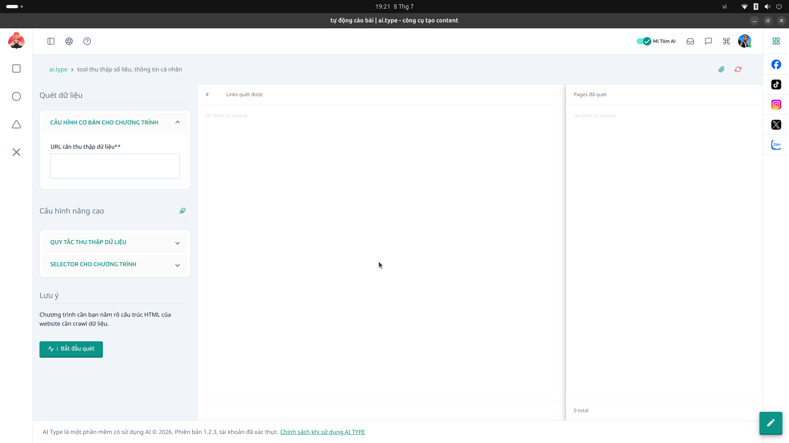

# 2. Hướng dẫn Màn hình "Tự động cào bài" (AI Crawl)

## Giới thiệu
Màn hình **AI Crawl (Tự động cào bài)** là một công cụ mạnh mẽ dành cho những người làm SEO, nghiên cứu thị trường hoặc xây dựng nội dung tự động. Công cụ này cho phép bạn thu thập tự động các bài báo, dữ liệu, thông số sản phẩm từ các trang web nguồn (website đối thủ hoặc website tin tức) để làm nguyên liệu, sau đó sử dụng sức mạnh của AI Writer để xào bài (spin) thành bài viết độc quyền của bạn.

---

## Hướng dẫn sử dụng chi tiết

### 1. Nhập URL mục tiêu
* **URL cần thu thập:** Đây là nơi bạn dán đường dẫn (Link) của trang web, danh mục hoặc bài báo mà bạn muốn quét. Hệ thống sẽ bắt đầu truy cập từ đường dẫn này để thu thập thông tin.

### 2. Cấu hình Quy tắc thu thập (Cấu hình nâng cao)
Ở khu vực bên trái màn hình, bạn sẽ thấy ba tab cấu hình chính:
* **Cấu hình cơ bản cho chương trình:** Tại đây bạn thiết lập số lượng trang tối đa cần quét, độ sâu của link (để tránh bot quét vào những trang không cần thiết) và tốc độ quét (tránh bị hệ thống chống bot của website nguồn chặn).
* **Quy tắc thu thập dữ liệu:** Nơi bạn thiết lập bộ lọc. Bạn có thể chỉ định chương trình *chỉ thu thập* những bài báo xuất bản trong vòng 7 ngày qua, hoặc *loại bỏ* những trang có chứa từ khóa nhất định (ví dụ: loại bỏ trang "Giới thiệu", "Liên hệ").
* **Selector cho chương trình (Rất quan trọng):** 
  * Đây là phần kỹ thuật để hướng dẫn bot biết chính xác **nội dung nằm ở đâu** trên website.
  * Bạn cần nhập các **CSS Selector** tương ứng với từng thành phần của bài viết nguồn như: thẻ chứa *Tiêu đề bài viết* (VD: `.article-title`, `h1.title`), thẻ chứa *Nội dung chính* (VD: `div.content-body`), và *Hình ảnh thumbnail* (VD: `img.thumbnail`).
  * Việc cấu hình đúng selector giúp dữ liệu lấy về cực kỳ sạch, không bị dính quảng cáo hay menu của website nguồn.

### 3. Nút "Bắt đầu quét"
Sau khi điền link và cấu hình Selector, bạn bấm nút này để robot bắt đầu đi thu thập dữ liệu tự động. Quá trình này có thể mất từ vài giây đến vài phút tùy thuộc vào quy mô trang web bạn muốn cào.

### 4. Quản lý luồng dữ liệu (Cột giữa và cột phải)
Quá trình quét được theo dõi real-time (thời gian thực) ngay trên màn hình:
* **Links quét được (Cột giữa):** Trong quá trình bò (crawl), hệ thống phát hiện được bao nhiêu đường link mới hợp lệ sẽ liên tục được cập nhật vào danh sách này. Nó cho bạn thấy tổng quan quy mô của trang web mục tiêu.
* **Pages đã quét (Cột phải):** Đây là danh sách các trang đã được thu thập dữ liệu thành công (bóc tách được tiêu đề, nội dung dựa theo selector bạn đã cài đặt). Từ danh sách này, bạn có thể click chọn để chuyển dữ liệu sang module **AI Writer** nhằm xào bài và đăng lên website của bạn.

---

## Mẹo sử dụng (Best Practices)
* **Luôn kiểm tra Selector:** Các website thường xuyên thay đổi giao diện, do đó CSS Selector cũng thay đổi theo. Nếu hệ thống báo quét thành công nhưng không có nội dung, hãy nhấn `F12` trên website nguồn để lấy lại Selector chuẩn xác.
* **Tôn trọng chính sách nguồn:** Hãy cài đặt thời gian trễ (delay) hợp lý giữa mỗi lần tải trang để tránh tạo áp lực lên máy chủ của website nguồn và bị khóa IP.
