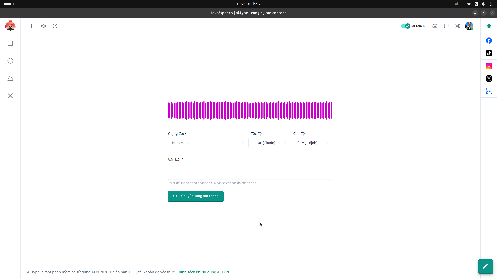

# 3. Hướng dẫn Màn hình "Text2Speech" (Chuyển văn bản thành giọng nói)

## Giới thiệu
**Text2Speech** là phân hệ xử lý giọng nói thông minh, tích hợp trực tiếp **model OmniVoice**. Tính năng này đặc biệt hữu ích cho các nhà sáng tạo nội dung muốn làm video Tiktok, Youtube Shorts, Podcast, hoặc làm lồng tiếng cho video mà không cần phải tự mình thu âm. Giọng đọc của AI rất tự nhiên, có ngắt nghỉ và ngữ điệu giống người thật.

---

## Hướng dẫn từng bước

### Bước 1: Lựa chọn và tùy chỉnh giọng đọc (Panel trên cùng)
Hệ thống cho phép bạn tùy biến âm thanh theo đúng nhu cầu của kênh:
* **Giọng đọc (*):** Nhấp vào menu thả xuống để chọn các giọng AI có sẵn. Các giọng này đã được tối ưu cho ngôn ngữ Tiếng Việt, mang đa dạng sắc thái từ giọng nam trầm ấm (Ví dụ: *Nam Minh*), giọng nữ truyền cảm, giọng kể chuyện cổ tích, đến giọng review năng động.
* **Tốc độ (Speed):** 
  * Mặc định là `1.0x (Chuẩn)`.
  * Nếu bạn làm video dạng review phim hoặc Tiktok có nhịp độ nhanh, bạn có thể tăng lên `1.1x` hoặc `1.25x`.
  * Nếu dùng để làm podcast tâm sự, đọc truyện đêm khuya, bạn có thể giảm tốc độ xuống `0.8x` hoặc `0.9x`.
* **Cao độ (Pitch):** Mặc định là `0`. Điều chỉnh cao độ để giọng đọc thanh hơn (số dương) hoặc trầm ấm hơn (số âm).

### Bước 2: Nhập kịch bản văn bản (Khu vực giữa)
* **Văn bản (*):** Đây là khu vực bạn dán kịch bản bài viết của mình vào.
* **Lưu ý CỰC KỲ QUAN TRỌNG để tối ưu hiệu suất:**
  * AI cần xử lý lượng dữ liệu khổng lồ cho mỗi chữ cái. Do đó, bạn tuyệt đối không nên dán một cục văn bản dài liền mạch không có dấu chấm phẩy.
  * **Hãy ấn Enter để xuống dòng** phân chia thành các đoạn văn nhỏ hoặc từng câu ngắn. Việc này giúp hệ thống chia nhỏ (chunking) tác vụ, giúp tốc độ xử lý nhanh hơn gấp nhiều lần và giọng đọc có nhịp ngưng nghỉ tự nhiên, hoàn hảo hơn.

### Bước 3: Tạo và xuất file âm thanh
* Sau khi hoàn tất cài đặt, bạn nhấn vào nút **(o) | Chuyển sang âm thanh** ở góc phải dưới của khung nhập liệu.
* Hệ thống sẽ bắt đầu kết nối tới engine OmniVoice. 
* Khi hoàn thành, một **sóng âm (waveform màu tím)** sẽ xuất hiện ở ngay trên màn hình. Bạn có thể nhấn nút **Play (▶)** để nghe thử lại. 
* Nhấn vào biểu tượng Tải xuống (Download) để tải file âm thanh định dạng `.mp3` hoặc `.wav` về máy tính của bạn và ghép vào các phần mềm dựng video như Premiere hay Capcut.
