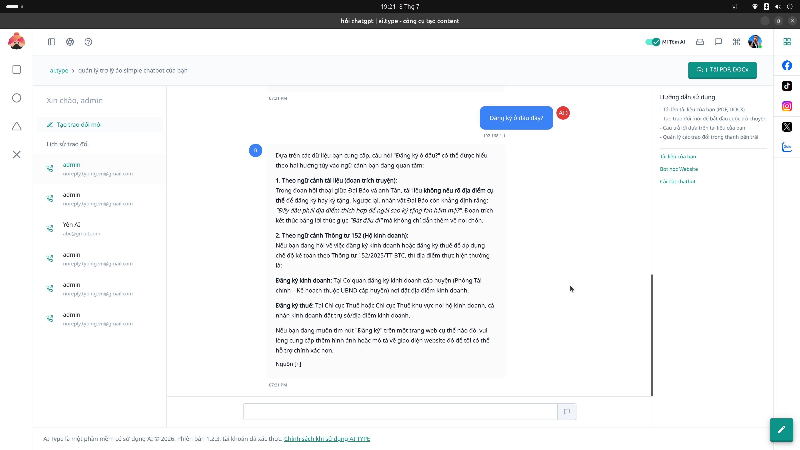

# 4. Quản lý Chatbot AI

**Mục đích:** Đào tạo và quản lý Chatbot AI tự động hỗ trợ khách hàng đa kênh (Fanpage, Website).

## Các trường nhập liệu (Inputs)
- **Nguồn dữ liệu đào tạo (Knowledge Base):**
  - Tải lên file tài liệu (PDF, Word, TXT) để Chatbot học kiến thức.
  - Cung cấp đường dẫn website để Chatbot tự đọc toàn bộ nội dung.
- **Cấu hình Prompt Chatbot:** Điều chỉnh tính cách, xưng hô của Chatbot (ví dụ: Luôn xưng "Dạ, em", đóng vai nhân viên tư vấn).

## Các nút thao tác (Buttons)
- **Upload File:** Bắt đầu tải tài liệu lên hệ thống để phân tích.
- **Kiểm tra kiến thức:** Cửa sổ Test Bot, cho phép bạn chat thử với Bot để xem nó đã học thuộc bài chưa.
- **Bật / Tắt Bot:** Tạm dừng tính năng trả lời tự động của Chatbot trên fanpage/website.
