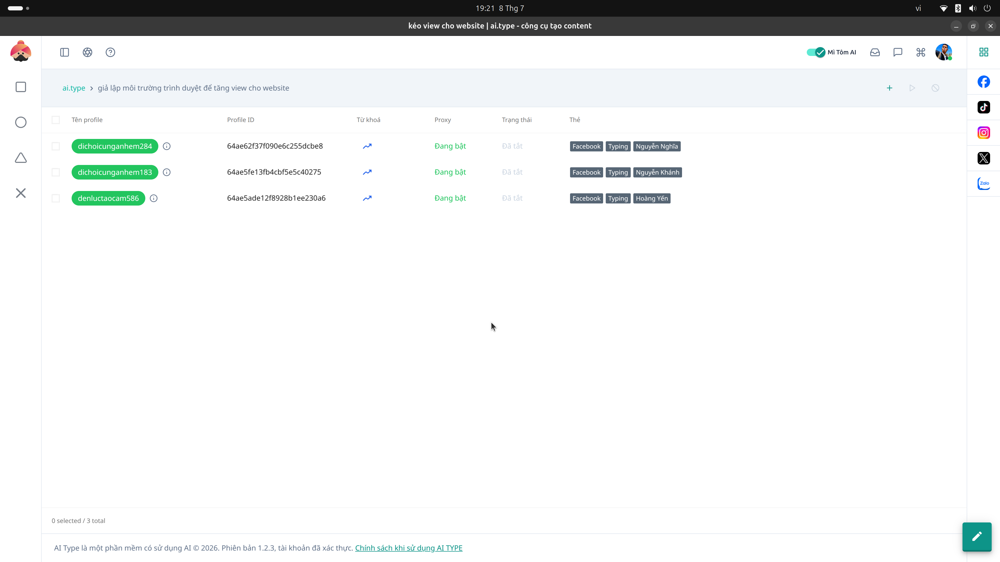

# 5. Quản lý Profile (Gologin)

**Mục đích:** Nuôi và quản lý hàng loạt tài khoản mạng xã hội (Facebook, Tiktok) an toàn, tránh bị khóa (Check-point).

## Các trường nhập liệu (Inputs)
- **Tên Profile:** Đặt tên gợi nhớ cho tài khoản.
- **Proxy:** Gán IP Proxy (Socks5/HTTP) riêng biệt cho từng Profile.
- **User-Agent & Fingerprint:** Thiết lập thông số vân tay trình duyệt giả lập.
- **Cookies:** Dán đoạn cookies để đăng nhập tài khoản mà không cần dùng mật khẩu.

## Các nút thao tác (Buttons)
- **Mở trình duyệt (Open):** Chạy trình duyệt Gologin riêng lẻ với thông số đã được cô lập.
- **Đóng (Close):** Tắt trình duyệt đang mở.
- **Chạy Script Kịch bản:** Đẩy Profile vào vòng lặp Auto-farm (tự động thả tim, like, bình luận).
