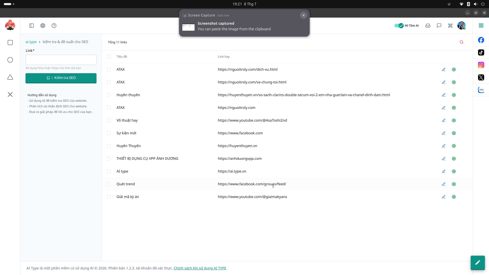

# 6. Hướng dẫn Nhóm Màn hình Quản lý SEO - Kiểm tra & Đề xuất

Đây là công cụ **SEO Audit On-page**. Nó đóng vai trò như một chuyên gia khám sức khỏe cho bài viết hoặc trang web của bạn trước khi đưa lên mạng.

## Cách sử dụng:
1. Copy đường link URL của bài viết trên website của bạn và dán vào ô **Link(*)**.
2. Nhấn nút **Kiểm tra SEO**.
3. Hệ thống sẽ cào qua bài viết và xuất ra một danh sách liệt kê các thành tố SEO cốt lõi.

## Đọc kết quả:
* **Bảng danh sách các Link:** Hiển thị Tiêu đề và URL gốc. 
* Cột ngoài cùng cung cấp các biểu tượng (icon) hành động:
  * Biểu tượng **Bút chì**: Nhấn vào để trực tiếp chỉnh sửa thẻ tiêu đề, mô tả Meta (Meta Description), thẻ H1, H2 nếu chúng bị phát hiện là quá dài, quá ngắn hoặc nhồi nhét quá nhiều từ khóa.
  * Biểu tượng **Check (Kiểm tra)**: Chạy lại quá trình chấm điểm SEO sau khi bạn đã chỉnh sửa.
