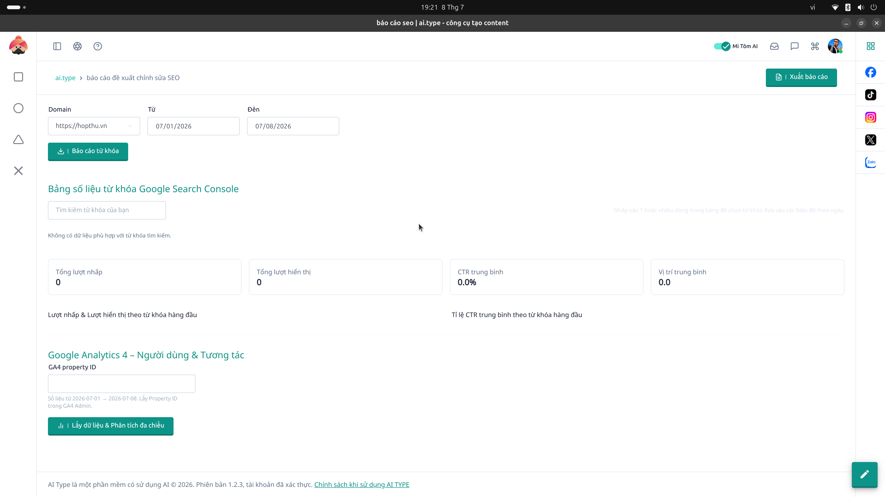

# 7. Báo cáo SEO (GSC Report)

**Mục đích:** Theo dõi hiệu quả của website và thứ hạng từ khóa trực tiếp từ Google Search Console và Google Analytics.

## Các trường nhập liệu (Inputs)
- **GA4 Property ID:** Mã số thuộc tính Analytics.
- **Domain:** Tên miền đang được kết nối với hệ thống.
- **Khoảng thời gian (Date Range):** Lọc báo cáo (Ví dụ: 7 ngày qua, 30 ngày qua).

## Ý nghĩa các thông số (Metrics)
- **Total Users:** Tổng số người dùng truy cập.
- **Screen Page Views:** Lượt xem trang.
- **Engagement Rate:** Tỷ lệ tương tác (%), tỷ lệ này càng cao chứng tỏ nội dung càng tốt.

## Các nút thao tác (Buttons)
- **Đồng bộ dữ liệu (Sync):** Cập nhật dữ liệu real-time từ API của Google.
