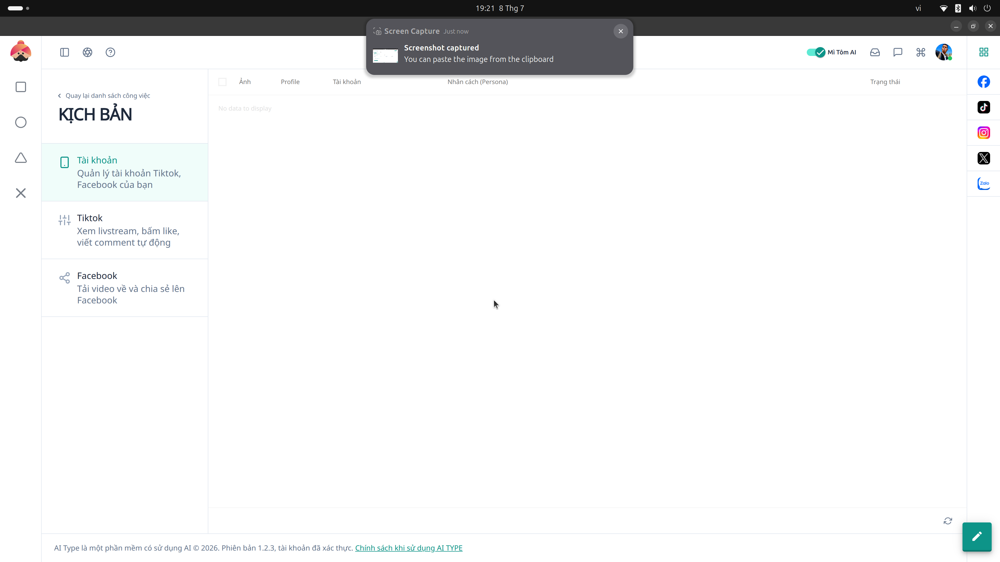

# 8. Kịch bản Tài Khoản (Script Account)

**Mục đích:** Thiết lập cấu hình hành động của các tài khoản ảo để "nuôi nick" hoặc spam an toàn.

## Các trường nhập liệu (Inputs)
- **Cấu hình độ trễ (Delay):** Thời gian chờ giữa các hành động (VD: Đợi 5 - 10 giây trước khi like).
- **Trạng thái:** Tắt/Bật tính năng bảo vệ chống ban tài khoản (Anti-Ban).

## Các nút thao tác (Buttons)
- **Lưu Kịch bản:** Ghi nhớ cấu hình Delay và Anti-Ban.
- **Gán cho Profile:** Áp dụng kịch bản này cho danh sách Gologin Profiles bạn đã chọn.
