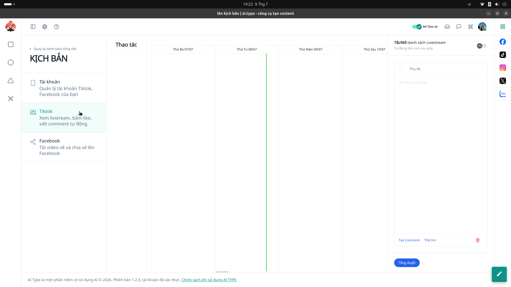

# 9. Kịch bản Tương tác TikTok

**Mục đích:** Tạo kịch bản auto-farm riêng biệt cho mạng xã hội TikTok.

## Các trường nhập liệu (Inputs)
- **Link Video TikTok:** Đường dẫn video bạn muốn cày view, tym hoặc comment.
- **Nội dung Bình luận:** Danh sách các câu bình luận (Spintax hỗ trợ) để clone tự động gõ.
- **Hành động:** 
  - Lướt xem ngẫu nhiên (Random scroll).
  - Thả tim (Like).
  - Bấm theo dõi (Follow).

## Các nút thao tác (Buttons)
- **Chạy Tự Động (Run Script):** Tiến hành điều khiển trình duyệt TikTok tự động.
- **Dừng (Stop):** Dừng toàn bộ kịch bản.
