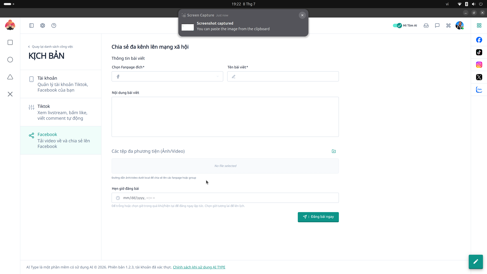

# 10. Kịch bản Tương tác Facebook

**Mục đích:** Tạo kịch bản tương tác ngầm dành riêng cho mạng xã hội Facebook (nuôi nick Facebook, cày tương tác nhóm).

## Các trường nhập liệu (Inputs)
- **Đường dẫn Bài viết / Group:** Link Facebook muốn nhắm mục tiêu.
- **Chuỗi thao tác:**
  - Xem Newsfeed ngẫu nhiên.
  - Bình luận bài viết.
  - Tự động nhắn tin qua Messenger.

## Các nút thao tác (Buttons)
- **Chạy Tự Động (Run Script):** Kích hoạt hệ thống tương tác Facebook.
- **Gửi sang N8N (Webhook):** Bắn tín hiệu sang luồng tự động hoá N8N để xử lý nâng cao.
