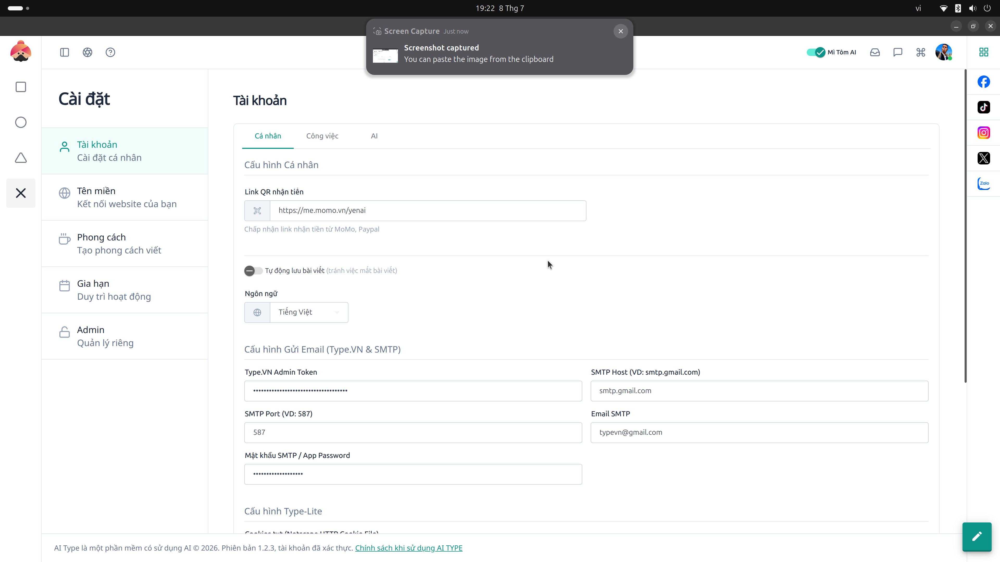

# 11. Cài đặt Hệ thống (Settings)

**Mục đích:** Nơi cấu hình các thông số quan trọng nhất của hệ thống (API Keys, Tài khoản, Mật khẩu).

## Các trường nhập liệu (Inputs)
- **Cấu hình Email (SMTP):** Nhập `SMTP Host`, `Port`, `Email`, và `App Password` để phần mềm gửi thư thông báo tự động.
- **Cấu hình API Key (AI):** 
  - API Key OpenAI (ChatGPT).
  - API Key Google Gemini (Aistudio).
  - API Key UModelverse.
- **Model Văn bản & Hình ảnh:** Chọn mô hình AI mặc định (VD: `gpt-4o`, `dall-e-3`).
- **Mật khẩu & Bảo mật:** Khung đổi mật khẩu (`New password`, `Current password`).

## Các nút thao tác (Buttons)
- **Lưu (Save):** Lưu lại thông tin cài đặt.
- **Thêm Key (Add Key):** Hỗ trợ thêm nhiều API Key để xoay vòng, chống sập giới hạn (Rate-limit).
- **Bật/Tắt Mì Tôm AI:** Tính năng dùng AI nâng cao nội bộ.
