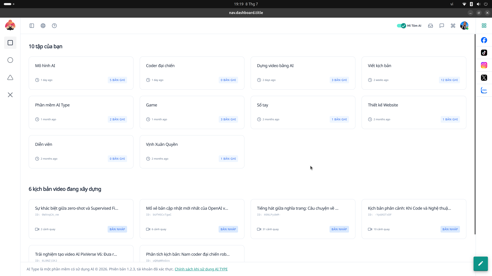

# 12. Hướng dẫn Màn hình Dashboard (Bảng điều khiển)

Màn hình **Dashboard** là nơi bạn nhìn thấy bức tranh toàn cảnh về toàn bộ dữ liệu, thư mục và tiến độ công việc đang thực hiện trên ai.type.

## Các khu vực chính:

### 1. Khu vực Tập tin/Thư mục (10 tập của bạn)
* Đây là không gian làm việc chia theo các dự án lớn như: Mô hình AI, Coder đại chiến, Dựng video bằng AI, Viết kịch bản, Thiết kế Website...
* Mỗi khối (card) sẽ hiển thị thông tin thời gian cập nhật gần nhất và số lượng bản ghi (bài viết/nội dung) đang chứa bên trong.
* **Lợi ích:** Giúp bạn truy cập nhanh vào dự án đang làm dang dở thay vì phải lục lọi qua nhiều menu.

### 2. Khu vực Công việc đang xây dựng
* Hiển thị trực quan các kịch bản, bài viết cụ thể đang được biên soạn.
* **Ví dụ:** Sự khác biệt giữa zero-shot và Supervised Fine-Tuning...
* Hệ thống hiển thị cả trạng thái nháp (BẢN NHÁP) và số lượng cảnh quay (scene) nếu đó là kịch bản video. Điều này đặc biệt hữu ích cho các Content Creator làm việc với đa phương tiện.
