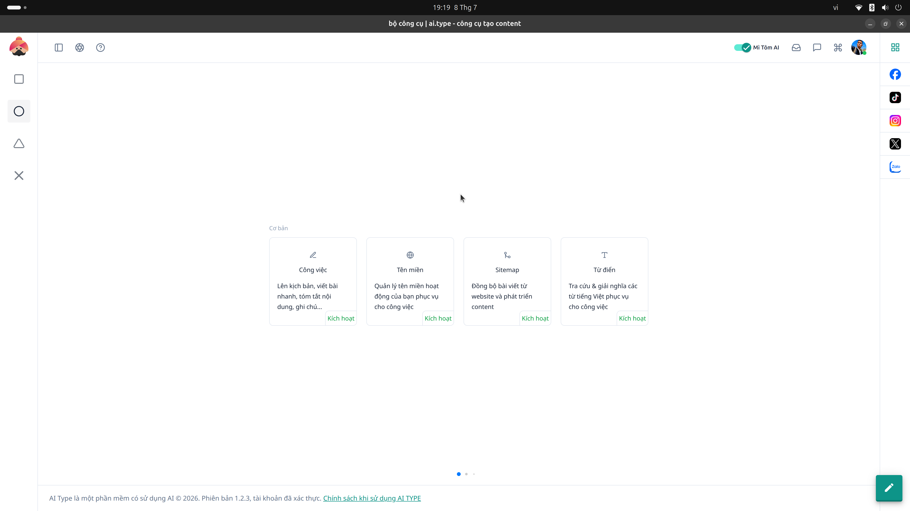

# 13. Hướng dẫn Màn hình Bộ Công Cụ Tổng Quan

Màn hình **Bộ công cụ** đóng vai trò là cửa ngõ trung tâm (hub) điều hướng bạn đến các tính năng kỹ thuật và quản trị cốt lõi của phần mềm.

## Danh sách các công cụ:
* **Công việc:** Nơi quản lý, lên kịch bản, viết bài nhanh, tóm tắt nội dung và ghi chú các ý tưởng sáng tạo.
* **Tên miền:** Cấu hình và quản lý các tên miền (Domain) hoạt động phục vụ cho việc đẩy bài tự động lên mạng.
* **Sitemap:** Trích xuất và đồng bộ bài viết, cấu trúc website để phục vụ cho các chiến dịch phát triển content SEO.
* **Từ điển:** Tra cứu, giải nghĩa các từ vựng tiếng Việt, phục vụ quá trình làm giàu vốn từ khi viết bài bằng AI.

Mỗi thẻ công cụ đi kèm nút **Kích hoạt** màu xanh lá. Hãy nhấp vào để mở giao diện làm việc chi tiết của từng tính năng.
