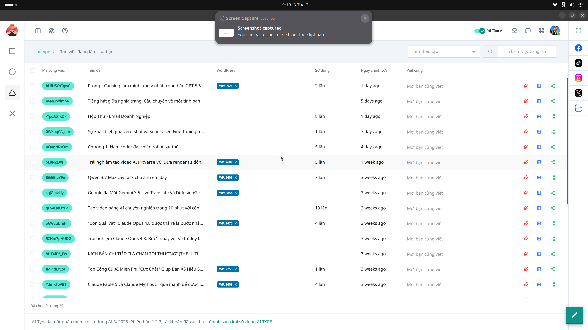

# 14. Danh sách Tiến trình ngầm (Jobs List)

**Mục đích:** Quản lý hàng chờ (Queue) của toàn bộ các tác vụ nặng trên hệ thống. Tránh treo phần mềm.

## Ý nghĩa các thông số
- **Tiến trình đang chạy (Processing):** Các việc AI đang miệt mài làm (VD: "Đang viết bài số 30/1000").
- **Tiến trình thất bại (Failed):** Các việc bị lỗi (do hết mạng, API key hết tiền, v.v.).

## Các nút thao tác (Buttons)
- **Hủy (Cancel):** Buộc dừng một tiến trình đang chạy dở.
- **Chạy lại (Retry):** Thử thực hiện lại một tiến trình vừa bị báo Lỗi (Failed).
- **Dọn dẹp (Clear):** Xóa lịch sử tiến trình đã hoàn thành (Done).
