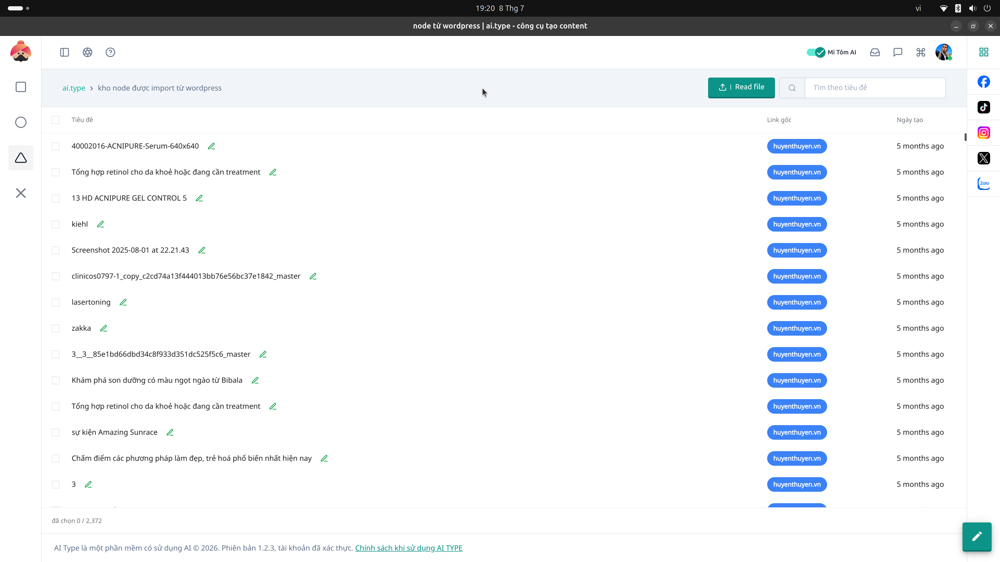
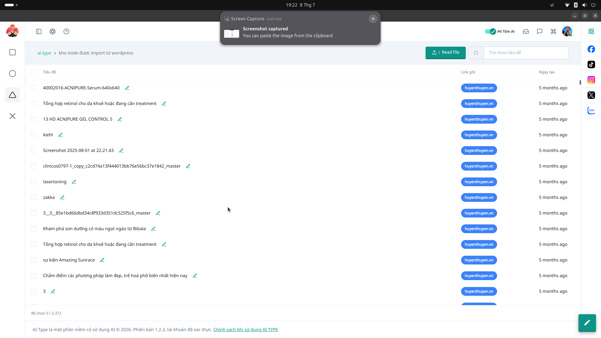

# 15. Quản lý Node WordPress (1 & 2)

**Mục đích:** Liên kết ứng dụng AI.Type với các website WordPress bên ngoài để tự động xuất bản (Publish) bài viết.

## Các trường nhập liệu (Inputs)
- **URL Website:** Đường dẫn trang WordPress gốc.
- **Username & App Password:** Tên tài khoản và Mật khẩu ứng dụng (không phải mật khẩu gốc) để kết nối REST API một cách bảo mật.

## Các nút thao tác (Buttons)
- **Kiểm tra kết nối:** Đảm bảo cấu hình đúng và website không bị Cloudflare hay Firewall chặn truy cập API.
- **Đồng bộ danh mục:** Kéo cấu trúc Category của web về hệ thống AI.
- **Xóa / Sửa Node:** Hủy hoặc thay đổi thông tin cấu hình website.
