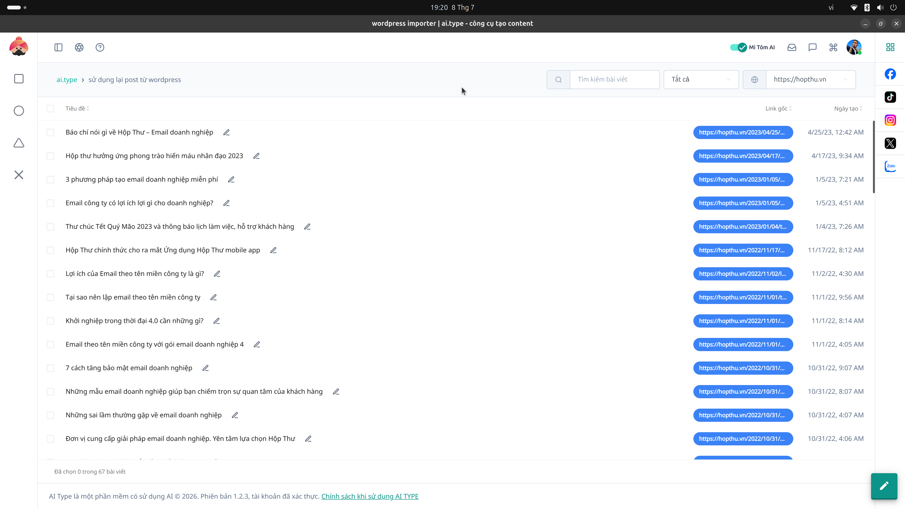

# 16. Hướng dẫn Màn hình Sử dụng lại Post từ WordPress (Importer)

Nếu bạn có một trang web WordPress với hàng ngàn bài viết cũ và muốn làm mới chúng để SEO tốt hơn, màn hình **Sử dụng lại post từ wordpress** chính là công cụ dành cho bạn.

## Chức năng chính
Hệ thống sẽ kéo toàn bộ tiêu đề và đường dẫn (URL) của các bài viết từ website được kết nối (VD: `https://hopthu.vn`) và liệt kê thành danh sách.

## Cách thao tác:
1. **Chọn Website cần xử lý:** Ở góc phải phía trên, có một menu thả xuống chứa danh sách các tên miền bạn đã kết nối. Hãy chọn website bạn muốn lấy bài.
2. **Lọc bài viết:** Sử dụng bộ lọc "Tất cả" hoặc thanh tìm kiếm để tìm chính xác bài viết cần "xào" (spin).
3. **Thực thi:**
   * Mỗi dòng hiển thị Tiêu đề, Link bài viết gốc và Ngày tạo bài trên website.
   * Bạn có thể chọn một hoặc nhiều bài (Check vào ô vuông bên trái).
   * Dùng tính năng này kết hợp với AI Writer để ra lệnh cho AI viết lại toàn bộ nội dung của các bài viết đã chọn theo một phong cách văn phong mới mẻ hơn, sau đó đăng ngược trở lại website.
