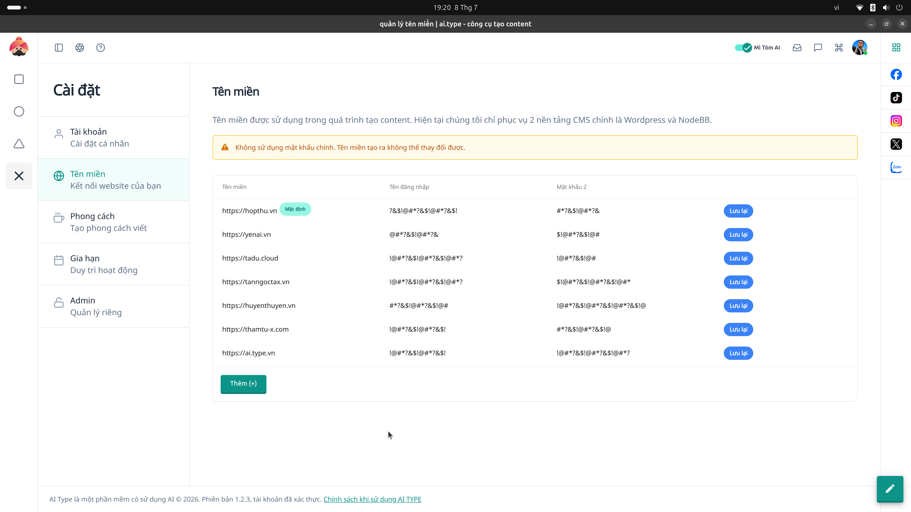

# 17. Cài đặt Tên miền (Domain Settings)

**Mục đích:** Thêm mới và xác thực các tên miền nội bộ hoặc mạng lưới vệ tinh thuộc quyền sở hữu của bạn.

## Các trường nhập liệu (Inputs)
- **Tên miền (Domain URL):** Nhập tên miền (VD: `ai.type.vn`).
- **Xác thực DNS / TXT:** Chuỗi văn bản để xác thực quyền chủ sở hữu với máy chủ.

## Các nút thao tác (Buttons)
- **Cập nhật (Update):** Lưu thông tin domain.
- **Kiểm tra trạng thái (Verify):** Check xem bản ghi DNS đã trỏ đúng và cập nhật thành công chưa.
