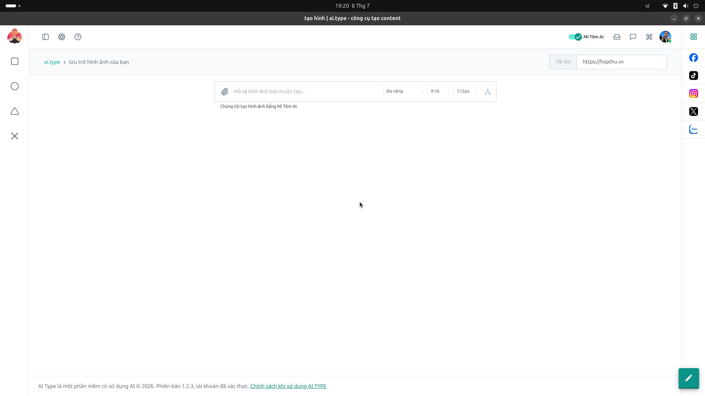

# 18. Trình Tạo Ảnh AI (Image Generation)

**Mục đích:** Tự động tạo ảnh minh hoạ cho bài viết dựa trên câu lệnh (Prompt).

## Các trường nhập liệu (Inputs)
- **Nội dung (Prompt):** Miêu tả bức ảnh bạn muốn AI vẽ (Hỗ trợ tiếng Việt/Anh).
- **Kích thước (Aspect Ratio):**
  - `16:9` (Dành cho YouTube / Ảnh bìa bài viết).
  - `9:16` (Dành cho TikTok / Reels / Shorts).
  - `1:1` (Dành cho Instagram / Vuông).
  - `4:5` (Facebook dọc).
  - `FB Link (1200x628)` (Ảnh preview chuẩn khi chia sẻ link web).

## Các nút thao tác (Buttons)
- **Tạo ảnh (Generate):** Gọi AI thực thi tạo ảnh (Ví dụ: dùng module `dall-e-3`).
- **Phép màu (Magic / Auto_Awesome):** AI tự động gợi ý / làm hay hơn câu lệnh Prompt của bạn.
- **Tải xuống (Download) & Đính kèm (Paper-clip):** Lưu về máy tính hoặc đính kèm ảnh ngay vào bài viết đang được soạn ở phân hệ khác.
