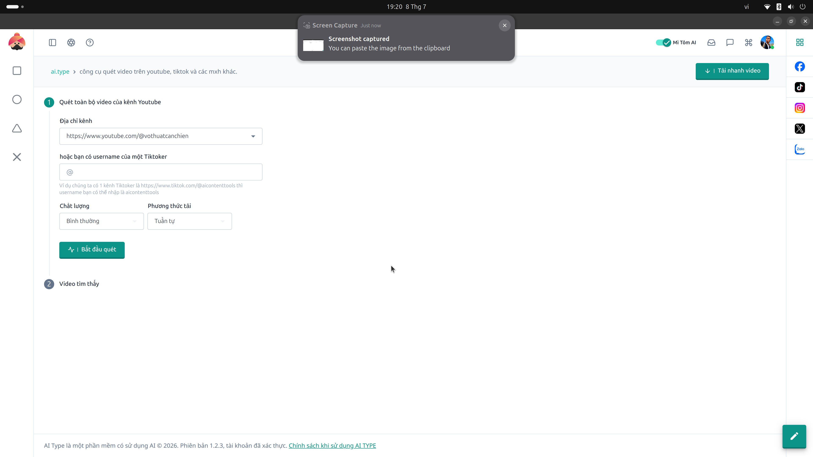

# 19. Tải Video MXH (Video Crawler / All-Tube)

**Mục đích:** Công cụ hàng loạt hỗ trợ tải (download) video không dính logo từ các MXH (TikTok, Youtube, Facebook, Reels).

## Các trường nhập liệu (Inputs)
- **Khung dán Link:** Hỗ trợ dán nhiều URL video cùng lúc, mỗi dòng 1 link. Hỗ trợ hàng trăm link cùng lúc.

## Các nút thao tác (Buttons)
- **Quét Video (Scan):** Đọc thông tin các link để lấy định dạng file, độ phân giải và tiêu đề gốc của video.
- **Tải Audio / Video:**
  - Tải định dạng hình ảnh và âm thanh gốc (.mp4).
  - Tải riêng file âm thanh (.mp3) bằng cách bấm nút `Nghe audio`.
