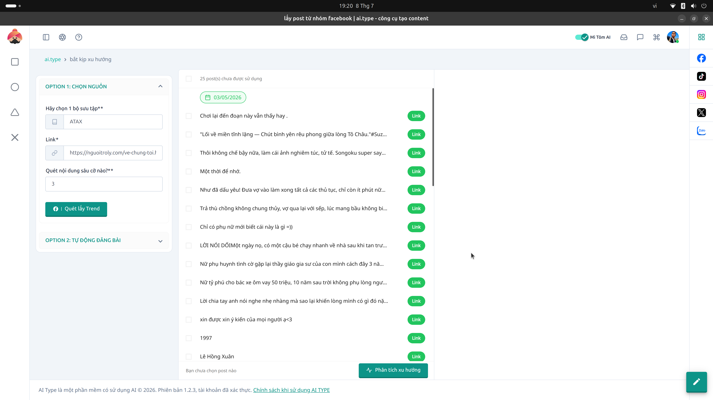

# 20. Bắt Trend Mạng Xã Hội (Facebook Trend)

**Mục đích:** Theo dõi và lọc ra các chủ đề, bài đăng đang Viral, đang Hot trên MXH để cướp ý tưởng viết bài nhanh chóng.

## Thông tin hiển thị
- Bảng xếp hạng các bài viết có lượng Like, Comment, Share tăng vọt (cao nhất).
- Hiển thị nguồn (Source) của trend (Tên fanpage, Nhóm bắt nguồn).

## Các nút thao tác (Buttons)
- **Lấy bài viết này:** Đẩy trực tiếp nội dung bài viral này sang mô-đun AI Writer để AI tự động xào lại (Spin) thành bài viết mới của bạn mà không dính bản quyền.
- **Refresh:** Tải lại xu hướng (Trend) mới nhất theo mốc thời gian thực trong ngày.
