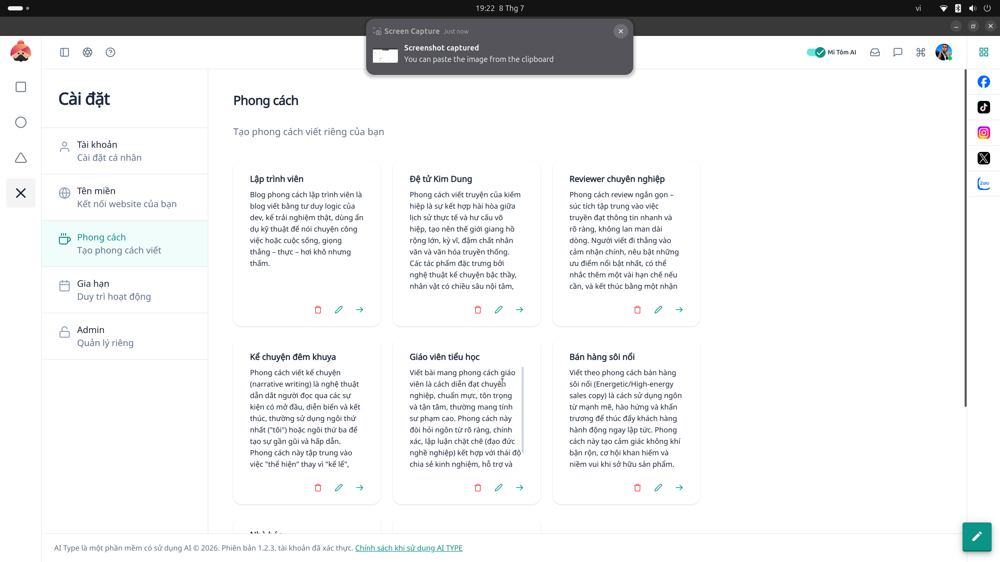

# 22. Văn phong AI & Từ Đồng Nghĩa (Writing Styles & Synonym)

**Mục đích:** Giúp cá nhân hoá lối hành văn của AI, làm cho văn bản trở nên giống con người hơn và vượt qua được các công cụ kiểm tra AI (AI Content Detectors).

## Các trường nhập liệu (Inputs)
- **Cấu hình thay thế từ:** (Ví dụ: đổi `rất tốt` -> `cực kỳ tuyệt vời`). Hệ thống sẽ tự động tìm các cụm từ này và hoán đổi sau khi AI đã viết xong bài.
- **Độ linh hoạt (Temperature):** Kéo thanh trượt để chỉnh độ sáng tạo/ngẫu hứng của AI. Thông số càng cao, AI viết càng ngẫu nhiên và mới mẻ.

## Các nút thao tác (Buttons)
- **Áp dụng (Apply):** Ghi nhớ cấu hình văn phong cho tất cả bài viết của chiến dịch hiện tại.
- **Xóa / Sửa:** Quản lý và tùy chỉnh thư viện từ đồng nghĩa cá nhân của bạn.
