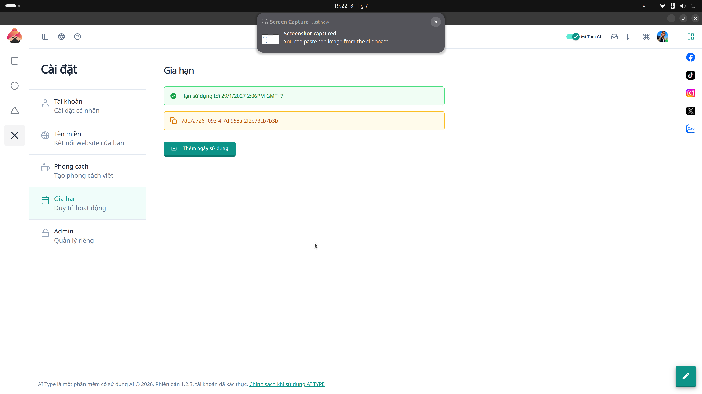

# 23. Đăng ký Dịch vụ (Subscription / Dollar)

**Mục đích:** Quản lý gói cước của tài khoản cá nhân, lịch sử thanh toán và gia hạn dịch vụ AI.Type.

## Các trường nhập liệu (Inputs)
- **Gói hiện tại:** Thông tin License Key bạn đang dùng và ngày hết hạn hệ thống.
- **Chọn gói gia hạn:** (Ví dụ: Gói Cơ bản / Chuyên cần / Cao cấp). Phụ thuộc vào nhu cầu sử dụng của bạn.

## Các nút thao tác (Buttons)
- **Xác nhận gia hạn:** Chuyển đến tiến trình thanh toán và tự động kích hoạt mã khóa (License Key).
- **Thêm mới / Cập nhật License Key:** Trong trường hợp bạn mua Key thông qua đại lý, hãy điền mã bản quyền bạn vừa mua vào hệ thống bằng nút này.
