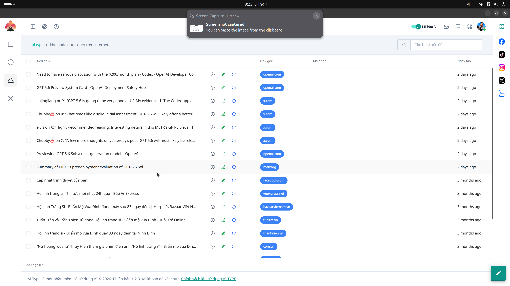

# 24. Quản lý Node Internet (Internet Nodes)

**Mục đích:** Quản trị các điểm kết nối máy trạm (Node) do người dùng hoặc hệ thống triển khai để hỗ trợ cho mạng lưới Crawl dữ liệu và vượt tường lửa (Bypass Firewall/Captcha).

## Các nút thao tác (Buttons)
- **Xuất dữ liệu (Export):** Kết xuất toàn bộ danh sách các Node Internet đang khả dụng dưới dạng file JSON hoặc CSV.
- **Bật / Tắt Node:** Thay đổi trạng thái chia sẻ tài nguyên mạng của từng Node cụ thể. Bạn có thể tắt một node nếu nó đang bị quá tải hoặc lỗi mạng.
