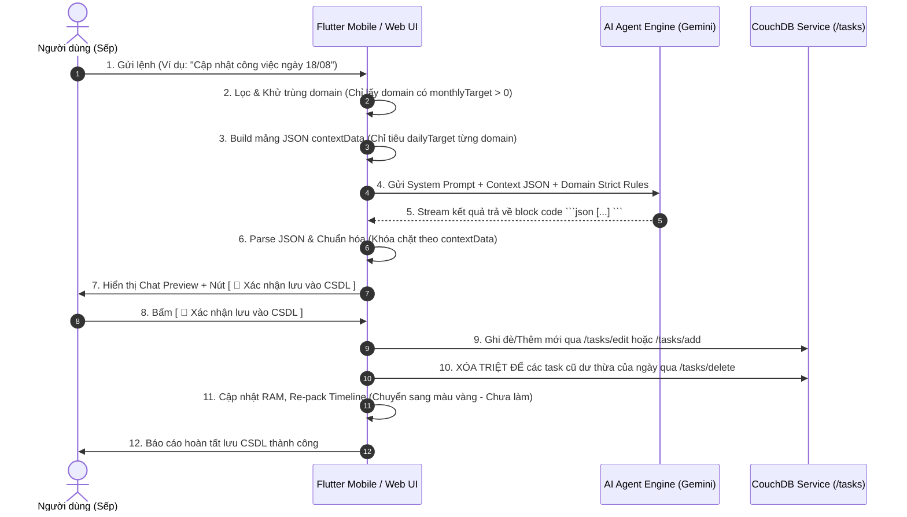

# 📱 ĐẶC TẢ KỸ THUẬT LOGIC AI AGENT SCHEDULE (DÀNH CHO FLUTTER MOBILE & WEB)

Tài liệu quy định **100% logic kỹ thuật**, thuật toán tính toán, quy tắc lọc tên miền, xây dựng System Prompt, cơ chế dọn dẹp task dư thừa khi cập nhật và quy trình viết bài SEO của màn hình **Lịch Marketing AI Agent** để đội ngũ phát triển ứng dụng **Flutter Mobile** thực thi đồng bộ và chuẩn xác tuyệt đối với bản Web Desktop.

---

## 1. TỔNG QUAN LUỒNG HOẠT ĐỘNG (SYSTEM ARCHITECTURE & WORKFLOW)



---

## 2. THUẬT TOÁN TÍNH TOÁN DỮ LIỆU ĐẦU VÀO (CONTEXT DATA PAYLOAD)

Trước khi gửi tin nhắn cho AI, hệ thống **BẮT BUỘC** phải build mảng JSON `contextData` để truyền trạng thái hiện tại của từng tên miền cho AI.

### 2.1. Quy Tắc Lọc và Chuẩn Hóa Danh Sách Tên Miền
1. **Khử trùng lặp tên miền (Deduplication)**: 
   - Chuẩn hóa tên miền: bỏ `https://`, `http://`, `www.` và dấu gạch chéo `/` ở cuối.
   - Nếu trong CSDL có nhiều bản ghi cùng trỏ về 1 tên miền (ví dụ `https://ai.type.vn` và `ai.type.vn`), gom về 1 bản ghi duy nhất.
2. **Nguồn chân lý của Chỉ tiêu tháng (`monthlyTarget`)**:
   - Lấy trực tiếp từ **Cài đặt Tên miền (`settings.domainTargets`)**.
   - Nếu hệ thống đã có cấu hình `domainTargets`, những tên miền nào **không có trong cấu hình (hoặc chỉ tiêu = 0)** sẽ có `monthlyTarget = 0` và **bị loại bỏ hoàn toàn** khỏi `contextData`. Tuyệt đối không fallback lấy giá trị 30 cũ từ các document CouchDB.
3. **Loại bỏ các dòng đặc biệt**:
   - Bỏ qua `total-summary-row`, `monthly-total-summary-row`.

---

### 2.2. Công Thức Tính Chỉ Số Từng Tên Miền
Với mỗi domain hợp lệ trong hệ thống:
1. `monthlyTarget`: Chỉ tiêu bài viết của tháng đang xét (lấy từ cấu hình `domainTargets`).
2. `createdTasksInMonth`: Tổng số task đang có trên lịch của tháng.
3. `doneTasksInMonth`: Số task trong tháng có `done == true` hoặc `status == 'done'` / `'completed'`.
4. `missingTasksToCreate`: `max(0, monthlyTarget - doneTasksInMonth)`.
5. `workingDaysLeft`: Số ngày làm việc còn lại trong tháng (sau khi **loại trừ** các ngày nằm trong mảng `disabledDates`).
6. `dailyTarget`:
   $$\text{dailyTarget} = \begin{cases} 
   \lceil \frac{\text{monthlyTarget}}{\text{workingDaysLeft}} \rceil & \text{nếu } \text{monthlyTarget} > 0 \text{ và } \text{workingDaysLeft} > 0 \\ 
   \text{monthlyTarget} & \text{nếu } \text{workingDaysLeft} \le 0 \\ 
   0 & \text{nếu } \text{monthlyTarget} \le 0 
   \end{cases}$$
   *(Ví dụ: 10 tên miền có chỉ tiêu 30 bài/tháng trong tháng 30 ngày làm việc $\rightarrow$ mỗi tên miền có `dailyTarget = 1` $\rightarrow$ Tổng số bài cần tạo cho ngày là **đúng 10 bài**).*

---

### 2.3. Cấu Trúc JSON `contextData` Gửi Cho AI
```json
[
  {
    "domain": "type.vn",
    "monthlyTarget": 30,
    "createdTasksInMonth": 15,
    "doneTasksInMonth": 10,
    "missingTasksToCreate": 20,
    "workingDaysLeft": 20,
    "dailyTarget": 1,
    "aiAnalysis": "Nền tảng AI Content Creator, tự động hóa SEO, Copywriting",
    "writingStyle": "Phong cách chuyên gia, thực chiến, truyền cảm hứng"
  },
  {
    "domain": "tadu.cloud",
    "monthlyTarget": 30,
    "createdTasksInMonth": 12,
    "doneTasksInMonth": 8,
    "missingTasksToCreate": 22,
    "workingDaysLeft": 20,
    "dailyTarget": 1,
    "aiAnalysis": "Máy chủ đám mây, Cloud Server, Cloud Hosting, VPS NVMe",
    "writingStyle": "Phong cách chuyên gia CNTT, tin cậy, súc tích"
  }
]
```

---

## 3. QUY TẮC NGHIÊM NGẶT THEO TÊN MIỀN (DOMAIN STRICT RULES)

Trong System Prompt gửi cho AI, **BẮT BUỘC** phải đính kèm các quy tắc chuyên môn ngách:
- **`type.vn` / `ai.type.vn`**: Nền tảng AI Content Creator, sáng tạo nội dung, bài viết blog SEO, Copywriting, tự động hóa marketing. **TUYỆT ĐỐI CẤM** viết về bàn phím, gõ 10 ngón, đánh máy chữ.
- **`hopthu.vn`**: Dịch vụ Email Doanh nghiệp (Business Email), bảo mật email, chống spam, xác thực DKIM/SPF/DMARC.
- **`tadu.cloud`**: Máy chủ đám mây, Cloud Server, Cloud Hosting, VPS NVMe tốc độ cao.
- **`yenai.vn`**: Tin tức công nghệ, Trí tuệ nhân tạo (AI), AI Agent, giải pháp chuyển đổi số.

---

## 4. REGEX PHÂN LOẠI Ý ĐỊNH (INTENT CLASSIFICATION)

1. **Regex Nhận Diện Ngày Cụ Thể**:
   `RegExp(r'\b(0?[1-9]|[12]\d|3[01])\/(0?[1-9]|1[0-2])(?:\/(\d{4}))?\b')`
   * Ví dụ: `18/08`, `18/08/2026`.
2. **Regex Nhận Diện Tháng**:
   `RegExp(r'tháng\s*(0?[1-9]|1[0-2])(?:\/(\d{4}))?', caseSensitive: false)`
   * Ví dụ: `tháng 8`, `tháng 08/2026`.
3. **Regex Nhận Diện Viết Blog SEO**:
   `RegExp(r'(viết blog|viết bài|soạn bài|chạy bài|sinh bài|tạo bài viết|viết nội dung|viết chi tiết)', caseSensitive: false)`

---

## 5. QUY TRÌNH 2 BƯỚC: TẠO/CẬP NHẬT TASK CHO NGÀY CỤ THỂ

### Bước 1: AI Phân Tích & Hiển Thị Preview
1. Gửi Prompt + `contextData` cho Gemini AI.
2. Bóc tách JSON trả về bằng hàm `getParsedAiTask`.
3. **Khóa chặt `normalizedList` theo `contextData`**: Chỉ giữ lại các domain có mặt trong `contextData`, cắt gọt hoặc bổ sung để số task đúng bằng `dailyTarget`.
4. Thiết lập sẵn trạng thái `done: false`, `status: 'pending'`, `percent: 0` cho toàn bộ task mới.
5. Hiển thị Preview danh sách bài viết trên chat + Nút **`[ 🚀 Xác nhận lưu vào CSDL ]`**.
6. **Tuyệt đối KHÔNG gọi API ghi CSDL ở Bước 1**.

### Bước 2: Khi Người Dùng Nhấn Nút "Xác nhận lưu vào CSDL" (`commitDayTasksToDB`)
Khi người dùng bấm xác nhận, hệ thống thực hiện lần lượt các bước sau:
1. **Cập nhật / Thêm mới Task vào CSDL**:
   - Đối với các task mới: Nếu ngày đó đã có task cũ $\rightarrow$ gọi `POST /tasks/edit` ghi đè lại nội dung và đổi trạng thái về `done: false, status: 'pending'`.
   - Nếu chưa có $\rightarrow$ gọi `POST /tasks/add`.
2. **XÓA SẠCH CÁC TASK CŨ DƯ THỪA TRONG NGÀY (RẤT QUAN TRỌNG)**:
   - Nếu số lượng task cũ trong ngày nhiều hơn số bài mới (ví dụ trước đó có 13 task mà nay chỉ cần 1 task):
   - Hệ thống **BẮT BUỘC gọi `POST /tasks/delete` để xóa sạch toàn bộ các task cũ dư thừa** khỏi CouchDB.
   - Loại bỏ các task dư thừa khỏi mảng RAM (`domainData.plan`).
3. **Cập nhật giao diện Timeline**:
   - Re-pack stream: `applyPackedTasks(domainItem, cleanPlan)`.
   - Cập nhật dòng tổng: `updateTotalSummaryRow()`.
   - Các thanh task trên Timeline chuyển từ màu **Xanh lá (Đã xong)** sang màu **Vàng/Cam (`bg-amber-400` - Chưa làm)**.
   - Số lượng hiển thị co về chính xác số task mới (ví dụ đúng 10 task).

---

## 6. QUY TRÌNH VIẾT BLOG CHUẨN SEO CHO NGÀY CỤ THỂ

Khi người dùng gửi lệnh `"Viết blog chuẩn SEO ngày DD/MM"`:
1. **Lấy danh sách task cần viết**:
   - Quét tất cả task của ngày đó đang ở trạng thái chưa làm (`done == false`).
   - Khớp đúng 10 task vừa được tạo/cập nhật mới.
2. **Thực thi viết bài chi tiết qua Gemini**:
   - Viết bài blog HTML chuẩn SEO (có thẻ `<h2>`, `<h3>`, `<p>`, `description`, `image_prompt`) bám sát `aiAnalysis` và `writingStyle`.
   - Lưu bài viết vào kho Soạn bài (`storeArchive` và `pending_articles`).
3. **Đánh dấu Hoàn thành [Done]**:
   - Cập nhật `task.done = true`, `task.status = 'done'`, `task.meta = 'Done'`.
   - Ghi vào CSDL CouchDB qua `POST /tasks/edit`.
   - Re-pack Timeline: các thanh công việc tự động đổi màu sang **Xanh lá (`bg-emerald-500` - Hoàn thành)**.

---

## 7. CẤU TRÚC PAYLOAD API COUCHDB

### 7.1. Thêm mới Task (`POST /tasks/add`)
```json
{
  "username": "user_name_account",
  "task": {
    "name": "Tiêu đề bài viết chuẩn SEO...",
    "meta": "Mô tả bài viết SEO...",
    "domain_id": "type.vn",
    "domain": "type.vn",
    "startDate": "2026-08-18T08:00:00",
    "endDate": "2026-08-18T17:00:00",
    "done": false,
    "status": "pending",
    "percent": 0,
    "canResizeLeft": true,
    "canResizeRight": true,
    "canDragX": true,
    "canDragY": false
  }
}
```

### 7.2. Cập nhật Task (`POST /tasks/edit`)
```json
{
  "username": "user_name_account",
  "task": {
    "_id": "task-uuid-101",
    "id": "task-uuid-101",
    "_rev": "1-rev-hash",
    "name": "Tiêu đề bài viết mới...",
    "meta": "Mô tả mới...",
    "domain_id": "type.vn",
    "domain": "type.vn",
    "startDate": "2026-08-18T08:00:00",
    "endDate": "2026-08-18T17:00:00",
    "done": false,
    "status": "pending",
    "percent": 0
  }
}
```

### 7.3. Xóa Task Dư Thừa (`POST /tasks/delete`)
```json
{
  "username": "user_name_account",
  "task": {
    "_id": "excess-task-uuid-999",
    "id": "excess-task-uuid-999",
    "_rev": "1-rev-hash",
    "domain_id": "type.vn"
  }
}
```

---

## 8. BẢNG CHEAT-SHEET TỔNG KẾT CHO TEAM FLUTTER & WEB

| Hành động | Điều kiện đầu vào | Xử lý AI / Preview | Xử lý CSDL & RAM khi Xác nhận | Trạng thái Timeline |
|---|---|---|---|---|
| **Cập nhật ngày DD/MM** | Người dùng chọn ngày DD/MM | AI sinh số bài = `dailyTarget` của từng domain hợp lệ trong `contextData`. | Ghi đè task mới, **XÓA SẠCH task cũ dư thừa** qua `/tasks/delete`. | Đổi màu sang **Vàng (`bg-amber-400` - Chưa làm)**, số lượng co về đúng số task mới. |
| **Viết blog SEO ngày DD/MM** | Lệnh viết blog ngày DD/MM | Gemini viết nội dung HTML chi tiết, lưu vào kho Soạn bài. | Gọi `/tasks/edit` set `done: true, status: 'done'`. | Đổi màu sang **Xanh lá (`bg-emerald-500` - Đã xong)**. |
| **Phân bổ tháng MM/YYYY** | Người dùng chọn phân bổ tháng | AI phân bổ dàn trải các ngày làm việc trong tháng. | Xóa plan cũ của tháng, thêm mới toàn bộ qua `/tasks/add`. | Hiển thị toàn bộ lịch của tháng. |
