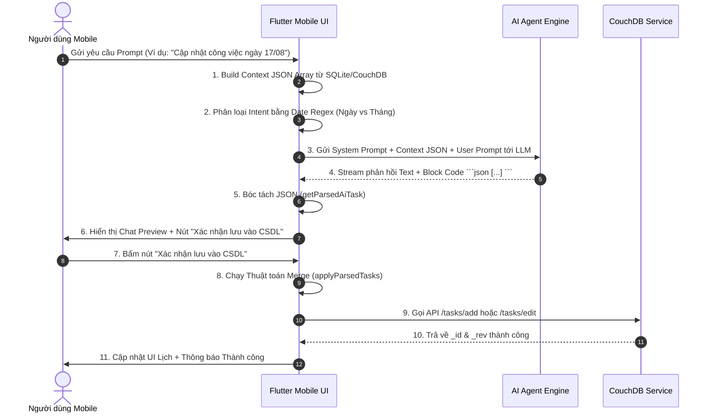

# 📱 ĐẶC TẢ KỸ THUẬT LOGIC AI AGENT SCHEDULE (DÀNH CHO FLUTTER MOBILE)

Tài liệu quy định **100% logic kỹ thuật**, thuật toán tính toán, quy tắc xây dựng System Prompt, trích xuất dữ liệu JSON và luồng gọi API CSDL của màn hình **Lịch Marketing AI Agent** để đội ngũ phát triển ứng dụng **Flutter Mobile** thực thi đúng tuyệt đối với bản Web Desktop.

---

## 1. TỔNG QUAN LUỒNG HOẠT ĐỘNG (FLUTTER MOBILE AGENT ARCHITECTURE)



---

## 2. THUẬT TOÁN TÍNH TOÁN DỮ LIỆU ĐẦU VÀO (CONTEXT DATA PAYLOAD)

Trước khi gửi tin nhắn cho AI, Flutter Mobile **BẮT BUỘC** phải build mảng JSON `contextData` để truyền trạng thái hiện tại của từng tên miền cho AI.

### 2.1. Công Thức Tính Chỉ Số Từng Tên Miền
Với mỗi domain trong hệ thống:
1. `monthlyTarget`: Chỉ tiêu bài viết đặt ra cho tháng đang xét.
2. `createdTasksInMonth`: Tổng số task đang có trên lịch của tháng.
3. `doneTasksInMonth`: Số task trong tháng có `done == true` hoặc `status == 'done'` / `'completed'` hoặc `meta` chứa từ `'done'`.
4. `missingTasksToCreate`: `max(0, monthlyTarget - doneTasksInMonth)`.
5. `workingDaysLeft`: Số ngày làm việc còn lại từ hôm nay đến cuối tháng (sau khi **loại trừ** các ngày nằm trong mảng `disabledDates`).
6. `dailyTarget`: 
   $$\text{dailyTarget} = \begin{cases} \lceil \frac{\text{monthlyTarget}}{\text{workingDaysLeft}} \rceil & \text{nếu } \text{monthlyTarget} > 0 \text{ và } \text{workingDaysLeft} > 0 \\ \text{monthlyTarget} & \text{nếu } \text{workingDaysLeft} \le 0 \\ 0 & \text{nếu } \text{monthlyTarget} \le 0 \end{cases}$$

### 2.2. Dạng JSON Context Data Truyền Cho AI
```json
[
  {
    "domain": "tadu.cloud",
    "monthlyTarget": 30,
    "createdTasksInMonth": 15,
    "missingTasksToCreate": 15,
    "workingDaysLeft": 15,
    "dailyTarget": 1,
    "aiAnalysis": "Tập trung các từ khóa về Cloud VPS, Server, Hosting doanh nghiệp",
    "writingStyle": "Phong cách chuyên gia CNTT, tin cậy, súc tích",
    "tasks": [
      {
        "id": "task-uuid-101",
        "name": "Tối ưu hóa Server Linux",
        "meta": "SEO task",
        "startDate": "2026-08-17T08:00:00",
        "endDate": "2026-08-17T17:00:00"
      }
    ]
  }
]
```

---

## 3. REGEX NHẬN DIỆN Ý ĐỊNH (INTENT CLASSIFICATION)

Flutter dùng 2 RegEx để phân biệt câu lệnh dành cho **NGÀY** hay **THÁNG**:

* **Regex Nhận Diện Ngày Cụ Thể**:
  `RegExp(r'\b(0?[1-9]|[12]\d|3[01])\/(0?[1-9]|1[0-2])(?:\/(\d{4}))?\b')`
  * Ví dụ khớp: `17/08`, `17/08/2026`, `01/09/2026`.

* **Regex Nhận Diện Tháng**:
  `RegExp(r'tháng\s*(0?[1-9]|1[0-2])(?:\/(\d{4}))?', caseSensitive: false)`
  * Ví dụ khớp: `tháng 8`, `tháng 08/2026`, `tháng 9`.

---

## 4. QUY TẮC BẮT BUỘC KHI XÂY DỰNG SYSTEM PROMPT

Khi gửi yêu cầu tới LLM, Flutter ghép System Prompt theo đúng nguyên tắc sau:

```text
DỮ LIỆU JSON CÁC TÊN MIỀN HIỆN TẠI (Hôm nay là: DD/MM/YYYY):
```json
<contextData JSON String>
```

YÊU CẦU CỦA NGƯỜI DÙNG:
<User Prompt>

HƯỚNG DẪN TRẢ LỜI:
- Bạn là chuyên gia SEO & trợ lý AI quản lý lịch công việc. Người dùng là Sếp (trò chuyện thân thiện, dùng emoji).
- DỮ LIỆU CÔNG VIỆC BẮT BUỘC PHẢI ĐẶT BÊN TRONG BLOCK CODE MẶC ĐỊNH LÀ ```json [ ... ] ```.
- THỜI GIAN VÀ MÚI GIỜ: Tất cả các task trong cùng một ngày BẮT BUỘC phải TRÙNG GIỜ (startDate: "YYYY-MM-DDT08:00:00", endDate: "YYYY-MM-DDT17:00:00"). TUYỆT ĐỐI KHÔNG CÓ CHỮ 'Z' Ở CUỐI.
- NẾU TẠO TASK MỚI: Tuyệt đối KHÔNG trả về trường "id".
- NẾU SỬA TASK CỤ THỂ: Giữ nguyên trường "id" của task đó.
- NẾU HOÀN THÀNH TASK: Giữ nguyên "id" + trả về "done": true (hoặc "status": "completed").
- NẾU XÓA TASK: Giữ nguyên "id" + trả về "_deleted": true.
- BẢO VỆ DỮ LIỆU: NẾU THAO TÁC THÁNG X, TUYỆT ĐỐI KHÔNG XÓA HAY SỬA BÀI CỦA CÁC THÁNG KHÁC.
```

---

## 5. ĐỊNH DẠNG JSON OUTPUT VÀ THUẬT TOÁN BÓC TÁCH (PARSING LOGIC)

### 5.1. Thuật Toán Trích Xuất JSON (`getParsedAiTask`)
Trong Dart / Flutter, dùng thuật toán sau để trích xuất JSON an toàn khỏi tin nhắn của AI ngay cả khi bị truncated:

```dart
dynamic getParsedAiTask(String content) {
  if (content.isEmpty) return null;
  
  // Tìm block code ```json ... ```
  final jsonBlockRegExp = RegExp(r'```(?:json)?\s*([\s\S]*?)\s*```', caseSensitive: false);
  final match = jsonBlockRegExp.firstMatch(content);
  String jsonStr = match != null ? match.group(1)!.trim() : content.trim();

  int startObj = jsonStr.indexOf('{');
  int startArr = jsonStr.indexOf('[');
  int endObj = jsonStr.lastIndexOf('}');
  int endArr = jsonStr.lastIndexOf(']');

  int start = (startArr != -1 && (startObj == -1 || startArr < startObj)) ? startArr : startObj;
  int end = (endArr != -1 && (endObj == -1 || endArr > endObj)) ? endArr : endObj;

  if (start != -1) {
    if (end == -1 || end < start) {
      int lastBrace = jsonStr.lastIndexOf('}');
      if (start == startArr) {
        jsonStr = (lastBrace != -1 && lastBrace > start)
            ? jsonStr.substring(start, lastBrace + 1) + ']'
            : jsonStr.substring(start) + ']';
      } else {
        jsonStr = jsonStr.substring(start) + '}';
      }
    } else {
      jsonStr = jsonStr.substring(start, end + 1);
    }
    try {
      return jsonDecode(jsonStr);
    } catch (e) {
      print('Failed to parse AI JSON: $e');
    }
  }
  return null;
}
```

---

## 6. QUY TRÌNH THAO TÁC ĐẦY ĐỦ CHO 3 HÀNH VI (TẠO, SỬA, HOÀN THÀNH)

### 6.1. Thao Tác TẠO MỚI Task (Create Task)

#### A. Cho NGÀY cụ thể (Ví dụ: `17/08/2026`):
* **User Prompt**: `"Cập nhật công việc ngày 17/08 cho tất cả tên miền"`
* **JSON AI trả về**:
```json
[
  {
    "domain": "tadu.cloud",
    "tasks": [
      {
        "name": "Phân tích kiến trúc Microservices trên Kubernetes 2026",
        "meta": "Nội dung SEO chuyên sâu cho hạ tầng Server",
        "startDate": "2026-08-17T08:00:00",
        "endDate": "2026-08-17T17:00:00"
      }
    ]
  }
]
```
* **Thuật toán xử lý trên Flutter**:
  1. Kiểm tra `task.id == null` $\rightarrow$ Thêm mới vào danh sách ngày `17/08/2026`.
  2. Hiển thị UI preview kèm nút **"Xác nhận lưu công việc ngày 17/08 vào CSDL"**.
  3. Khi bấm **Xác nhận**: Gọi `POST /tasks/add` $\rightarrow$ Nhận `_id` & `_rev` lưu lại.

#### B. Cho THÁNG (Ví dụ: `Tháng 08/2026`):
* **User Prompt**: `"Phân bổ công việc tháng 08/2026 cho tất cả tên miền"`
* **JSON AI trả về**:
```json
[
  {
    "domain": "tadu.cloud",
    "tasks": [
      {
        "name": "Bài viết Ngày 1: Tối ưu Database PostgreSQL",
        "startDate": "2026-08-01T08:00:00",
        "endDate": "2026-08-01T17:00:00"
      },
      {
        "name": "Bài viết Ngày 2: Cấu hình Nginx Load Balancer",
        "startDate": "2026-08-02T08:00:00",
        "endDate": "2026-08-02T17:00:00"
      }
    ]
  }
]
```

---

### 6.2. Thao Tác CHỈNH SỬA Task (Edit Task)

#### A. Cho NGÀY cụ thể:
* **User Prompt**: `"Sửa bài viết ngày 17/08 của tadu.cloud thành: Hướng dẫn cài đặt Docker trên Ubuntu 24.04"`
* **JSON AI trả về**:
```json
[
  {
    "domain": "tadu.cloud",
    "tasks": [
      {
        "id": "task-uuid-101",
        "name": "Hướng dẫn cài đặt Docker trên Ubuntu 24.04 LTS",
        "meta": "Cập nhật bài hướng dẫn chi tiết",
        "startDate": "2026-08-17T08:00:00",
        "endDate": "2026-08-17T17:00:00"
      }
    ]
  }
]
```
* **Thuật toán xử lý trên Flutter**:
  1. Khớp `task.id == "task-uuid-101"` trong RAM.
  2. Cập nhật `name`, `meta`, `startDate`, `endDate`.
  3. Hiển thị UI preview kèm nút xác nhận.
  4. Khi bấm **Xác nhận**: Gọi `POST /tasks/edit` gửi `_id`, `_rev`, `name`, `meta`.

#### B. Cho THÁNG:
* **User Prompt**: `"Sửa toàn bộ tiêu đề bài viết tháng 08 của tadu.cloud theo phong cách chuyên gia tin cậy"`
* **JSON AI trả về**:
```json
[
  {
    "domain": "tadu.cloud",
    "tasks": [
      {
        "id": "task-uuid-101",
        "name": "Bí quyết tối ưu hạ tầng Server dành cho CTO 2026",
        "meta": "Giải pháp bảo mật và chịu tải cao",
        "startDate": "2026-08-01T08:00:00",
        "endDate": "2026-08-01T17:00:00"
      },
      {
        "id": "task-uuid-102",
        "name": "Chiến lược chống tấn công DDoS cho hệ thống E-commerce",
        "meta": "Hướng dẫn cấu hình Firewall & CDN",
        "startDate": "2026-08-02T08:00:00",
        "endDate": "2026-08-02T17:00:00"
      }
    ]
  }
]
```

---

### 6.3. Thao Tác HOÀN THÀNH Task (Complete Task)

#### A. Cho NGÀY cụ thể:
* **User Prompt**: `"Đánh dấu hoàn thành bài viết ngày 17/08 của domain tadu.cloud"`
* **JSON AI trả về**:
```json
[
  {
    "domain": "tadu.cloud",
    "tasks": [
      {
        "id": "task-uuid-101",
        "done": true,
        "status": "completed"
      }
    ]
  }
]
```
* **Thuật toán xử lý trên Flutter**:
  1. Khớp `task.id == "task-uuid-101"`.
  2. Set `task.done = true`, `task.status = 'done'`.
  3. Khi bấm **Xác nhận**: Gọi `POST /tasks/edit` để lưu trạng thái hoàn thành vào CouchDB.

#### B. Cho THÁNG:
* **User Prompt**: `"Đánh dấu hoàn thành tất cả task từ ngày 01/08 đến 15/08 của tadu.cloud"`
* **JSON AI trả về**:
```json
[
  {
    "domain": "tadu.cloud",
    "tasks": [
      { "id": "task-uuid-101", "done": true, "status": "completed" },
      { "id": "task-uuid-102", "done": true, "status": "completed" },
      { "id": "task-uuid-103", "done": true, "status": "completed" }
    ]
  }
]
```

---

### 6.4. Thao Tác XÓA Task (Delete Task)

* **User Prompt**: `"Xóa công việc bài viết VPS ngày 17/08"`
* **JSON AI trả về**:
```json
[
  {
    "domain": "tadu.cloud",
    "tasks": [
      {
        "id": "task-uuid-101",
        "_deleted": true
      }
    ]
  }
]
```
* **Thuật toán xử lý trên Flutter**:
  1. Nếu có `id`: Xóa task có `id` khớp khỏi danh sách RAM.
  2. Nếu không có `id` nhưng có `startDate`: Xóa các task trong ngày đó.
  3. Khi bấm **Xác nhận**: Gọi `POST /tasks/delete` lên CouchDB.

---

## 7. CẤU TRÚC PAYLOAD API COUCHDB TRÊN FLUTTER MOBILE

Khi người dùng nhấn nút **"Xác nhận lưu vào CSDL"**, Flutter Mobile thực thi các request HTTP sau:

### 7.1. Payload POST `/tasks/add` (Thêm Task Mới)
```json
{
  "username": "user_name_account",
  "task": {
    "name": "Hướng dẫn tối ưu hóa hạ tầng Cloud VPS cho doanh nghiệp 2026",
    "meta": "Bài viết phân tích chuyên sâu về tốc độ và bảo mật Cloud VPS.",
    "domain_id": "tadu.cloud",
    "domain": "tadu.cloud",
    "startDate": "2026-08-17T08:00:00",
    "endDate": "2026-08-17T17:00:00",
    "canResizeLeft": true,
    "canResizeRight": true,
    "canDragX": true,
    "canDragY": false
  }
}
```

### 7.2. Payload POST `/tasks/edit` (Cập Nhật Hoặc Đánh Dấu Hoàn Thành)
```json
{
  "username": "user_name_account",
  "task": {
    "_id": "task-uuid-101",
    "id": "task-uuid-101",
    "_rev": "1-a87f9b2c3d4e5f",
    "name": "Hướng dẫn cài đặt Docker trên Ubuntu 24.04 LTS",
    "meta": "Done",
    "done": true,
    "status": "completed",
    "domain_id": "tadu.cloud",
    "domain": "tadu.cloud",
    "startDate": "2026-08-17T08:00:00",
    "endDate": "2026-08-17T17:00:00"
  }
}
```

---

## 8. BẢNG TÓM TẮT CHEAT-SHEET CHO TEAM FLUTTER MOBILE

| Thao tác | Phạm vi | Dấu hiệu JSON AI trả về | Xử lý logic Flutter Mobile | API CouchDB gọi |
|---|---|---|---|---|
| **TẠO MỚI** | NGÀY | `tasks` không có `id`, có `startDate` = `08:00:00` | Append task mới vào ngày | `POST /tasks/add` |
| **TẠO MỚI** | THÁNG | `tasks` không có `id`, rải đều các ngày | Append các task mới vào tháng | `POST /tasks/add` |
| **CHỈNH SỬA** | NGÀY | Có `id` + `name`/`meta` mới | Update `name`/`meta` cho task có `id` khớp | `POST /tasks/edit` |
| **CHỈNH SỬA** | THÁNG | Mảng danh sách `id` + `name`/`meta` mới | Update tiêu đề/mô tả hàng loạt | `POST /tasks/edit` |
| **HOÀN THÀNH** | NGÀY | Có `id` + `done: true` | Set `done = true`, `status = 'completed'` | `POST /tasks/edit` |
| **HOÀN THÀNH** | THÁNG | Mảng danh sách `id` + `done: true` | Set `done = true` hàng loạt cho tháng | `POST /tasks/edit` |
| **XÓA TASK** | NGÀY/THÁNG | Có `id` + `_deleted: true` | Filter loại bỏ task khỏi danh sách RAM | `POST /tasks/delete` |
